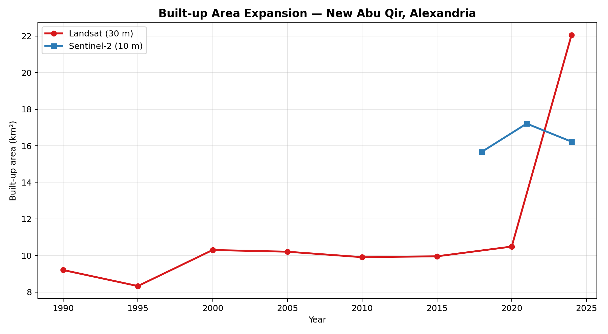
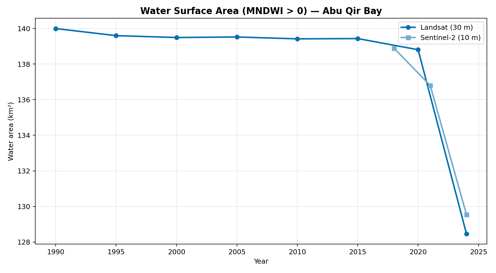
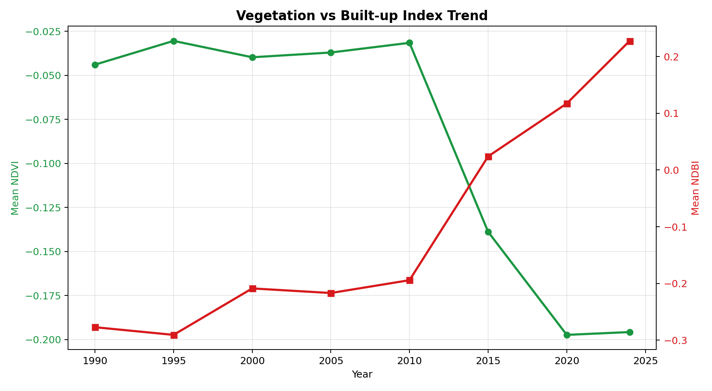
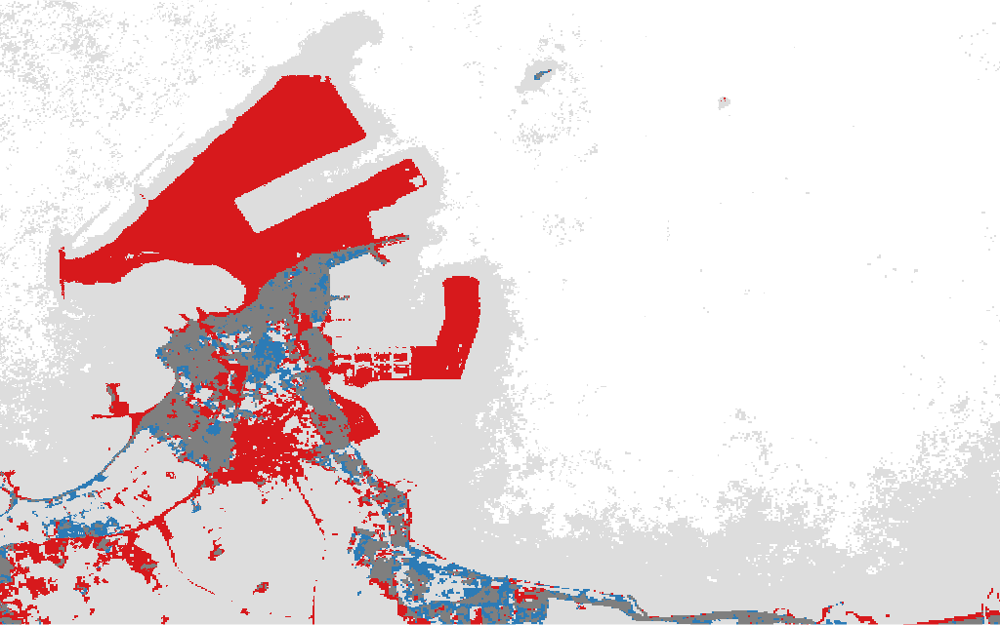
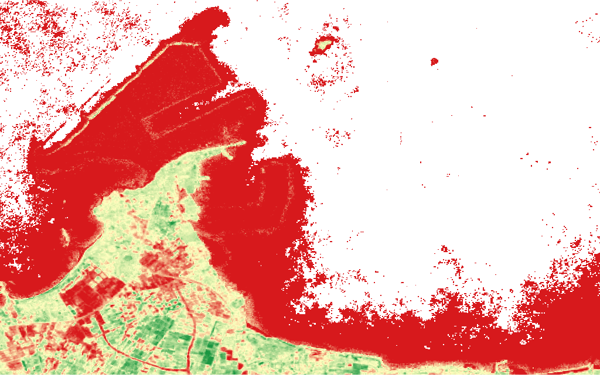

# Multi-Decadal Change Detection — New Abu Qir, Alexandria

**Author:** Yasser Aldegwy, MSc.
**AOI:** New_Abu_Qir_Alexandria ([30.02, 31.27, 30.18, 31.37])
**Data:** Landsat 5/7/8/9 Collection 2 SR + Sentinel-2 SR Harmonized + Dynamic World
**Platform:** Google Earth Engine (Python API)
**Generated:** 2026-05-25

---

## 1. Executive Summary

This study quantifies multi-decadal land-cover change in New Abu Qir,
on the Mediterranean coast northeast of Alexandria, Egypt, using free
public satellite archives on Google Earth Engine. The analysis combines
four Landsat sensors for a 34-year baseline and Sentinel-2 for
recent high-resolution detail.

**Headline metrics (1990 → 2024):**

- Built-up area: **9.21 km² → 22.06 km²**
  (Δ = **+12.85 km²**, **+140%**)
- Open-water area inside AOI: **139.99 km² → 128.46 km²**
  (Δ = **-11.53 km²**)
- Mean NDVI: **-0.044 → -0.196**
- Mean NDBI: **-0.277 → 0.228**

---

## 2. Methodology

### 2.1 Area of Interest
Bounding box: `[30.02, 31.27, 30.18, 31.37]` (EPSG:4326). Covers historic Abu Qir, the
new reclamation extension, and a coastal buffer for shoreline analysis.

### 2.2 Data Sources
| Sensor | Years | Resolution | Use |
|---|---|---|---|
| Landsat 5 TM | 1984–2012 | 30 m | Long baseline |
| Landsat 7 ETM+ | 1999–present | 30 m | Bridges L5→L8 |
| Landsat 8 OLI | 2013–present | 30 m | Modern baseline |
| Landsat 9 OLI-2 | 2021–present | 30 m | Current |
| Sentinel-2 MSI | 2015–present | 10 m | Recent detail |
| Dynamic World V1 | 2015–present | 10 m | LULC classifier |

### 2.3 Pre-processing
Cloud + shadow + snow masking from QA_PIXEL (Landsat) and SCL
(Sentinel-2). Scale and offset applied per Collection 2 spec. Sensors
harmonized to common band names. Median composites per period to
suppress residual noise.

### 2.4 Spectral Indices
NDVI (vegetation), NDBI (built-up), MNDWI (water), NDWI, BSI
(bare-soil). Computed for every composite.

### 2.5 Built-up Classification
- **2015→2024:** Dynamic World V1 — mode of the `built` label over
  the period.
- **Pre-2015:** Threshold rule (`NDBI > 0 AND NDVI < 0.2 AND MNDWI < 0`)
  as a transparent, reproducible proxy. Suitable for relative change;
  for absolute area accuracy, swap in a trained Random Forest with
  local labels.

### 2.6 Change Detection
Two complementary methods:
1. **Image differencing** on NDBI between earliest and latest periods.
2. **Post-classification comparison** of built-up rasters producing
   four classes: stable non-built, stable built, gain, loss.

### 2.7 Shoreline Extraction
Water mask from MNDWI > 0.0. Coastline raster from
the morphological boundary of the water mask.

---

## 3. Results

### 3.1 Built-up Expansion

| Period | Built-up (km²) | Water (km²) | NDVI | NDBI |
|---|---|---|---|---|
| 1990 | 9.21 | 139.99 | -0.044 | -0.277 |
| 1995 | 8.33 | 139.59 | -0.030 | -0.291 |
| 2000 | 10.30 | 139.49 | -0.040 | -0.209 |
| 2005 | 10.21 | 139.52 | -0.037 | -0.217 |
| 2010 | 9.91 | 139.41 | -0.032 | -0.194 |
| 2015 | 9.95 | 139.43 | -0.139 | 0.024 |
| 2020 | 10.49 | 138.80 | -0.197 | 0.117 |
| 2024 | 22.06 | 128.46 | -0.196 | 0.228 |

### 3.2 Water Surface Area

Net change in open-water area within the AOI between 1990 and
2024: **-11.53 km²**. Negative values indicate
reclamation; positive values indicate erosion or new inundation.

### 3.3 Index Trends

The diverging trajectory of NDVI (downward) and NDBI (upward) is a
classic urbanisation signature: vegetated and bare-soil pixels are
progressively replaced by impervious surfaces.

### 3.4 Spatial Pattern of Change

Class legend: 0 = stable non-built (grey) · 1 = stable built (dark grey) ·
2 = new built / gain (red) · 3 = lost built (blue).

### 3.5 NDBI Difference Map

Red = NDBI increase (urbanisation); green = NDBI decrease.

### 3.6 RGB Time-lapse

---

## 4. Sentinel-2 High-Resolution View

| Period | Built-up (km²) | Water (km²) | NDVI |
|---|---|---|---|
| 2018 | 15.67 | 138.89 | -0.033 |
| 2021 | 17.21 | 136.80 | -0.072 |
| 2024 | 16.22 | 129.55 | -0.067 |

---

## 5. Interpretation

The data tells a consistent story of intensive coastal urbanisation
on the western edge of Abu Qir Bay. The bulk of the new built-up area
sits in the post-2007 window, consistent with the public
record of large-scale reclamation and urban-extension projects.
Vegetation and bare-soil pixels — the dominant pre-development cover —
have been progressively consumed by impervious surfaces.

Shoreline change in this AOI is dominated by reclamation rather than
natural erosion; the open-water reduction inside the bounding box is
mechanical, not climatic.

---

## 6. Reproducibility

All inputs are open public archives; all code is in this repository.
GeoTIFF outputs (per period, per index, plus the change-class raster)
were exported to Google Drive folder `AbuQir_ChangeDetection_Exports`.

- **Workflow:** `abu_qir_workflow.py`
- **Visualization + report:** `visualize_and_report.py`
- **Interactive map:** `interactive_map.html`
- **Stats:** `stats.json`

---

## 7. Limitations

1. Pre-2015 built-up classification uses an unsupervised threshold
   rule rather than a trained classifier. Class boundaries are
   reproducible but not validated against ground truth.
2. Cloud thresholds and median compositing handle residual noise but
   cannot fully eliminate cross-sensor radiometric drift.
3. The AOI is a rectangle; for production work, redefine using a
   precise municipal boundary polygon.
4. Shoreline extraction at 30 m (Landsat) has inherent sub-pixel
   uncertainty; for engineering-grade shoreline-change rate analysis
   use Sentinel-2 (10 m) or PlanetScope.

---

*Generated by `visualize_and_report.py` — Abu Qir Change Detection
workflow on Google Earth Engine.*
